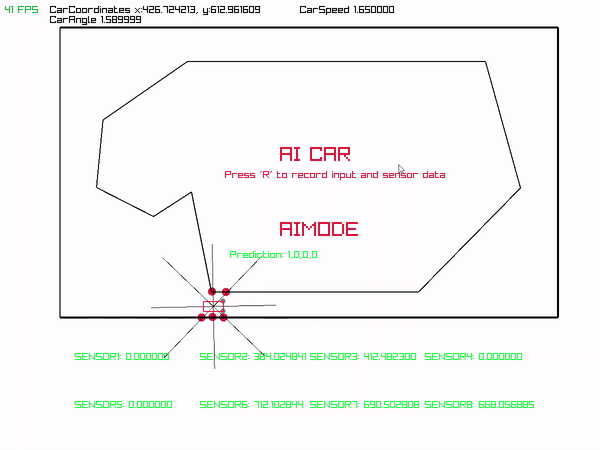

# Self-driving-car



# TO-DO
- [x] build basic game
- [x] refactor code
- [x] implement AI

# About-Project
This is a project to simulate a self Driving car that can drive around a track.

# building
To build the project, you need to install the following dependencies:
CPP
- ```raylib```
- ```winsocket```
Python 
- ```keras```

To compile the project, you need to run the following command:
cpp
- make 
python
- python NeuralNetworks/main.py

# How-to-use
open Main.exe then you can see the window of the car simulation
press **R** to record the data from car which will be stored in in data_outputs.csv in same folder
Run NeuralNetworks/train.py to train the model 
Run NeuralNetworks/main.py to start the server 
In car simulation, press **t** to toggle between ai mode and manual mode

# Working 
The car simulation is written in c++ and predictoin is done in python.
using TCP sockets to communicate between the server and the client. 

# contributing 
this project is still in development.
but the major part is done 
so if you want to contribute feel free to do so.

